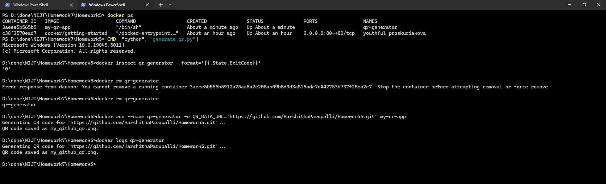

Going from Scripts to Apps 
# QR Code Generator Project

## About the Project
The QR Code Generator Project is a Python-based application that generates a QR code linking to a user-specified URL. This project is containerized with Docker to provide a consistent and portable environment for running the application. The QR code can be scanned by any mobile device to quickly access the linked webpage, making it useful for sharing links efficiently.

### Key Features:
- Generates a QR code in PNG format that links to a specified URL.
- Customizable through environment variables for flexibility.
- Uses Python 3.10-slim for a lightweight container.
- Simple Docker commands for building and running the containerized application.

### Technologies Used:
- **Python**: The main programming language for the application.
- **Docker**: To containerize and deploy the application.
- **qrcode Library**: Python library used for creating the QR code.
- **Pillow (PIL)**: Image processing library to save the QR code image.

## Getting Started

### Prerequisites:
- [Docker](https://www.docker.com/get-started) must be installed and running on your system.
- Basic knowledge of Python and Docker commands.

### Installation and Usage

### QR Code Linking to My GitHub

### Log Output Screenshot

